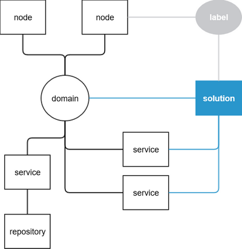

# [e2e-bridge-cli](README.md "Back to documentation of e2e-bridge-cli"): deliver Command

A command of the E2E Bridge command-line interface to deliver services to E2E Bridges that can be used in a continuous delivery environment
``` bash
$ e2ebridge deliver --domain ${DomainName} [--node ${NodeName}]... [--solution ${SolutionName}]... [--service ${ServiceName}]... [--break-on-error] [--dry-run]
```

## Features

The e2ebridge deliver command features setting up a continuous delivery project with a variety of settings and options. All this is managed by JSON files in a
specific file structure.

* grouping Bridge nodes to a domain
* labeling nodes
* defining a setup as a solution
* defining conditions for deployment options, and service preferences and settings

## Installation
See [documentation of e2e-bridge-cli](README.md "e2e-bridge-cli") for more information on how to install the e2e-bridge-cli.

## On this page

- [File Structure of a Delivery Project](#file-structure-of-a-delivery-project)
- [Examples](#examples)
  - [Example Using Solutions](#example-using-solutions) (Step by Step)
  - [Example Using Multiple Domains](#example-using-multiple-domains) (Overview)
- [Reference](#reference)
  - [Deployment Domains](#deployment-domains)
  - [Bridge Nodes](#bridge-nodes)
  - [Service Repositories](#service-repositories)
  - [Service Deployment Options](#service-deployment-options)
    - [Conditions](#conditions)
    - [Node.js Service Settings](#nodejs-service-settings)
  - [Solutions](#solutions)
  - [Additional Command Options](#additional-command-options)


## File Structure of a Delivery Project

A delivery project consists of files in a predefined file structure. Apart from the service repositories, these files are JSON files.

``` bash
myProject
├── domains
│   └── myDomain.json
├── nodes
│   ├── myNode1.json
│   ├── myNode2.json
│   └── myNode3.json
├── repositories
│   ├── anxUMLServiceRepository.rep
│   ├── anotherxUMLServiceRepository.rep
│   └── aNodeJSServiceRepository.zip
├── services
│   ├── anxUMLService.json
│   ├── anotherxUMLService.json
│   ├── aNodeJSService.json
│   └── aNodeJSService.settings
│       ├── deploymentSettings1.json
│       └── deploymentSettings2.json
└── solutions
    └── solution1.json
```

Back to [documentation of e2e-bridge-cli](README.md "e2e-bridge-cli").


## Examples


### Example Using Solutions

We have a set of related xUML services:
- one manager service: ManageWorkers
- two worker services that are managed by the manager service: Worker1, Worker2

These services should always be deployed together.


#### STEP1: Create a Project Folder

- Create a folder to store your delivery project in, e.g. **myProject**.


#### STEP 2: Define a Solution

- Define a solution that distincts between master and slave services.<br/>
  Create a folder **solutions** in your project folder and create a JSON file in this folder.

- **Project Structure**
  ``` bash
  myProject
   └── solutions
       └── ManagementSolution.json
  ```
- **JSON File**
  ``` json
  {
      "services": {
          "master": ["ManageWorkers"],
          "slave": ["Worker1", "Worker2"]
      }
  }
  ```


#### STEP 3: Define a Destination

- These services should be deployed to two nodes: Server1, Server2, whereas the manager service will be running on Server1 only.<br/>
Create a folder **nodes** in your project folder, and create a JSON file for each physical node you want to be able to deploy to.

- **Project Structure**
  ``` bash
   myProject
   ├── nodes
   │   ├── Server1.json
   │   └── Server2.json
   └── solutions
       └── ManagementSolution.json
  ```
- **JSON Files**
  ``` json
  {
      "location": "server1.myDomain.com",
      "user": "myUser",
      "password": "myPassword",
      "label": ["slave", "master"]
  }
  ```
  ``` json
  {
      "location": "server2.myDomain.com",
      "user": "myUser",
      "password": "myPassword",
      "label": ["slave"]
  }
  ```


#### STEP 4: Define a Domain
- The deliver command is ruled by domains, so we need one:<br/>
Create a folder **domains** in your project folder, and create a JSON file to store the domain settings.
With this domain, you want to be able to deploy to the previously defined nodes in STEP 3, and you want to use the **ManagementSolution** defined in STEP 2.

- **Project Structure**
  ``` bash
   myProject
   ├── domains
   │   └── Domain.json
   ├── nodes
   │   ├── Server1.json
   │   └── Server2.json
   └── solutions
       └── ManagementSolution.json
  ```
- **JSON Files**
  ``` json
  {
      "nodes": ["Server1", "Server2"],
      "solutions": ["ManagementSolution"]
  }
  ```


#### STEP5: Specify the Services to Deploy

- We want to deploy three services: the management service, and two workers.<br/>
Create a folder **services** in your project folder, In this folder, create three JSON files to store the service settings.
These files must be named as defined in the service list of the previously defined solution in STEP 2: ManageWorkers, Worker1, Worker2.

- **Project Structure**
  ``` bash
   myProject
   ├── domains
   │   └── Domain.json
   ├── nodes
   │   ├── Server1.json
   │   └── Server2.json
   ├── services
   │   ├── ManageWorkers.json
   │   ├── Worker1.json
   │   ├── Worker2.json
   └── solutions
       └── ManagementSolution.json
  ```
- **JSON Files**
  ``` json
  {
      "type": "xUML",
      "repository": "ManageWorkersService.rep",
      "deploymentOptions": {
          "startup": false,
          "overwrite": true,
          "overwritePrefs": false
      }
  }
  ```
  ``` json
  {
      "type": "xUML",
      "repository": "Worker1Service.rep",
      "deploymentOptions": {
          "startup": false,
          "overwrite": true,
          "overwritePrefs": false
      }
  }
  ```
  ``` json
  {
      "type": "xUML",
      "repository": "Worker2Service.rep",
      "deploymentOptions": {
          "startup": false,
          "overwrite": true,
          "overwritePrefs": false
      }
  }
  ```


#### STEP6: Provide the Service Repositories to Deploy

- We need to provide the service repositories with the deployment project.<br/>
Create a folder **repositories**, and copy all necessary service repositories as defined in STEP 5 to this folder.

- **Project Structure**
  ``` bash
   myProject
   ├── domains
   │   └── Domain.json
   ├── nodes
   │   ├── Server1.json
   │   └── Server2.json
   ├── repositories
   │   ├── ManageWorkersService.rep
   │   ├── Worker1Service.rep
   │   └── Worker2Service.rep
   ├── services
   │   ├── ManageWorkers.json
   │   ├── Worker1.json
   │   ├── Worker2.json
   └── solutions
       └── ManagementSolution.json
  ```


#### STEP 7: Run the Delivery Command

- Run the delivery command with
  ```bash
  e2ebridge-cli deliver --domain Domain --solution ManagementSolution --break-on-error
  ```

  You will get the follwing output if everything is fine:
  ```bash
  Reading configuration.
  Working, please wait.
  ✔ Worker2 on Server1: deploy
  ✔ Worker1 on Server1: deploy
  ✔ ManageWorkers on Server1: deploy
  ✔ Worker2 on Server2: deploy
  ✔ Worker1 on Server2: deploy
  deliver : SUCCESS
  ```


### Example Using Multiple Domains

This examples shows how to deploy the same service to two different nodes with divergent settings. To achieve this we use the "[Conditions]" feature within the
settings definitions.

#### Project Structure
  ``` bash
   myProject
   ├── domains
   │   ├── Prod.json
   │   └── Test.json
   ├── nodes
   │   ├── ProdSserver.json
   │   └── TestServer.json
   ├── repositories
   │   └── SAPInterface.rep
   └── services
       └── SAPInterface.json
  ```


#### JSON Files

**Domains**
- **Production**: `Prod.json`
  ``` json
  {
      "nodes": "ProdServer",
      "services": "SAPInterface"
  }
  ```
- **Test**: `Test.json`
  ``` json
  {
      "nodes": "TestServer",
      "services": "SAPInterface"
  }
  ```

**Nodes**
- **Production Server**: `ProdServer.json`
  ``` json
  {
      "location": "prod.myDomain.com",
      "user": "myUser",
      "password": "myPassword"
  }
  ```
- **Test Server**: `TestServer.json`
  ``` json
  {
      "location": "test.myDomain.com",
      "user": "myUser",
      "password": "myPassword"
  }
  ```

**Services**
- **SAP Interface Service**: `SAPInterface.json`
  ``` json
  {
      "type": "xUML",
      "repository": "SAPInterface.rep",
      "deploymentOptions": {
          "startup": true,
          "overwrite": true,
          "overwritePrefs": false
      }
      "settings": {
          "addOn_SAP_RFC_Service_ProgramID":
              [
                  "RFC_TEST_SERVER_ID",
                  {
                  "domain": "Prod",
                      "value": "RFC_PROD_SERVER_ID"
                  }
                  ],
          "addOn_SAP_RFC_Service_SAPGatewayName":
              [
                  "80.241.97.227",
                  {
                      "domain": "Prod",
                      "value": "80.241.97.331"
                  }
              ],
          "addOn_SAP_RFC_Service_SAPGatewayService": "sapgw00"
      }
  }
  ```


#### Calling the Command

- **Test Scenario**
  ```bash
  e2ebridge deliver --domain Test
  ```
  Deliver service **SAPInterface** to server test.mydomain.com with the following settings:
  - ProgramID = RFC_TEST_SERVER_ID (condition 1, default value)
  - SAPGatewayName = 80.241.97.227 (condition 1, default value)
  - SAPGatewayService = sapgw00 (condition 1, default value)

- **Production Scenario**
  ```bash
  e2ebridge deliver --domain Prod
  ```
  Deliver service **SAPInterface** to server prod.mydomain.com with the following settings:
  - ProgramID = RFC_PROD_SERVER_ID (condition 2)
  - SAPGatewayName = 80.241.97.331 (condition 2)
  - SAPGatewayService = sapgw00 (condition 1, default value)
  
You will get the follwing output if everything is fine:
```bash
Reading configuration.
Working, please wait.
✔ SAPInterface on TestServer: deploy
✔ SAPInterface on TestServer: settings
✔ SAPInterface on TestServer: start
deliver : SUCCESS
```

Back to [documentation of e2e-bridge-cli](README.md "e2e-bridge-cli").


## Reference


### Deployment Domains

Folder **domains** contains JSON files that each define a domain you want to be able to deploy to. The name of the JSON file determines the name of the domain.

Content structure:
``` bash
{
    "nodes": ["myNode1", "myNode2", ...],
    "services": ["myService1", ...],
    "solutions": ["mySolution1", ...]
}
```
| Option                | Description                                                                                                                        | Mandatory | Allowed Values                            |
|-----------------------|------------------------------------------------------------------------------------------------------------------------------------|-----------|-------------------------------------------|
| **nodes**             | Specify a list of nodes you want to be able to deploy to. Details of these nodes must be defined in folder **nodes**.              | yes       | nodes defined in folder **nodes**         |
| **services**          | Specify a list of services you want to deliver with this domain. Details of these services must be defined in folder **services**. | no        | services defined in folder **services**   |
| **solutions**         | You can define solutions and associate them to domains. Details of these solutions must be defined in folder **solutions**.        | no        | solutions defined in folder **solutions** |

In general, **services** and **solutions** are not mandatory. However, you need to relate the services you want to deliver to to your domain definition.
So, either specify services directly in the domain definition, or specify services indirectly via a solution. If you do not specify services either way, the deliver command will be
aborted with error.

The difference between specifing a list of services and a solution is that by only specifing services these will get deployed to all nodes of the domain. By defining a solution, you
can select services and nodes, and relate the two for specific cases. By that you can create a more complex delivery scenario.

Additionally, you can restrict a delivery scenario by giving nodes, services and/or solutions as parameters to the deliver command.
- If you specify a node with the command call, only this node will be taken into account for deployment - all other nodes will be ignored.
  The node must be part of the list of nodes of this domain, however.
- Same with the other parameters, services and solutions.
- All parameters can be combined. The delivery will be performed with the lowest common denominator of all parameters.


### Bridge Nodes

Folder **nodes** contains one JSON file per node you want to be able to deploy to. The name of the JSON file determines the name of the node.
Content structure:
``` bash
{
    "location": "myMachineName.myDomain.com",
    "user": "myUser",
    "password": "myPassword",
    "label": ["myFirstLabel", "mySecondLabel", ...]
}
```
| Option                | Description                                                                                                                           | Mandatory | Allowed Values                                |
|-----------------------|---------------------------------------------------------------------------------------------------------------------------------------|-----------|-----------------------------------------------|
| **location**          | Specify the fully qualified domain name of the Bridge host you want to use for delivery. The location may also contain a port number. | yes       | a valid machine name (with/without port)      |
| **user**              | Specify a Bridge user with the necessary rights to deploy software. If you do not specify a user, you will be prompted for it.        | no        | a valid user name                             |
| **password**          | Specify the password according to the user. If you do not specify a user, you will be prompted for it.                                | no        | password string                               |
| **label**             | You can apply labels to nodes. These labels relate solutions and specific setting definitions to this node.                           | no        | string or array of strings                    |

Usage of nodes in the command call is optional. If no node is specified with the command call, deployment will be done for all nodes of the given domain.


### Service Repositories

Folder **repositories** of the delivery project contains the service repositories of the services to be deployed. Define with the **services** definitions, which services to deploy
and how.


### Service Deployment Options

Folder **services** contains one JSON file per service to be deployed. The file name *must* match the service instance name on the E2E Bridge.
Additionally, you can specify deployment options, and preferences and settings (all combined with conditions) per service here.

Content structure:
``` bash
{
    "type": "xUML|node|java",
    "repository": "myServiceRepository.rep|myNodeJSrepository.zip|myJavaService.jar",
    "deploymentOptions": {
        "startup": [true|false, condition (see below)],
        "overwrite": [true|false, condition (see below)],
        "overwritePrefs": [true|false, condition (see below)],
        "npmInstall": [true|false, condition (see below)],
        "runScripts": [true|false, condition (see below)],
        "instanceName": ["anInstanceName (Node.js services only)", condition (see below)],
        "preserveNodeModules": [true|false, condition (see below)],
        "stopTimeout": [aNumberOfSeconds, condition (see below)],
        "allowKill": [true|false, condition (see below)]
    }
    "preferences": {
        "bridgeServerLogLevel": [None|Fatal|Error|Warning|Info|Debug, condition (see below)],
        "transactionLogLevel": [None|Custom|Service|IOExternal|IOInternal, condition (see below)],
        "transactionLogRotInterval": [DAILY|HOURLY, condition (see below)],
        "automaticStartup": [true|false, condition (see below)],
        "automaticRestart": [true|false, condition (see below)],
        "owner": ["a valid Bridge user", condition (see below)]
    }
    "settings": {
        "setting id": ["a valid default setting value", condition (see below)]
        ...
    }
}
```
| Option                | Description                                                                                          | Mandatory | Allowed Values                         |
|-----------------------|------------------------------------------------------------------------------------------------------|-----------|----------------------------------------|
| **type**              | Specify the type of service: xUML service, Node.js service or Java service.                          | yes       | xUML&#124;node&#124;java               |
| **repository**        | Specify the name of the repository from folder **repositories** or a path relative to this folder.   | yes       |                                        |
| **deploymentOptions** | Define the deployment options. Each single option is optional.                                       | no        | See table of deployment options below. |
| **preferences**       | Define the service preferences. Each single option is optional.                                      | no        | See table of preferences below.        |
| **settings**          | Specify setting values for the service to be deployed with. See chapter **Conditions** further below.| no        |                                        |


| Deployment Options      | Description                                                                                                          | Allowed Values (default in bold)|
|-------------------------|----------------------------------------------------------------------------------------------------------------------|---------------------------------|
| **startup**             | Specify whether the service should be started after deployment. This option is valid for all service types.          | **true**&#124;false             |
| **overwrite**           | Specify whether the deployment should overwrite an existing service. This option is valid for all service types.     | **true**&#124;false             |
| **overwritePrefs**      | Specify whether changed service preferences should be overwritten. This option is valid for all service types.       | true&#124;**false**             |
| **npmInstall**          | Specify whether the deployment should run an `npm install` command. This options is valid for Node.js services only. | true&#124;**false**             |
| **runScripts**          | Specify whether scripts should be executed on `npm install`. This options is valid for Node.js services only.        | true&#124;**false**             |
| **instanceName**        | For Node.js services, you can change the service instance name on deployment, if a new name is provided here.        | a string (default=**undefined**)|
| **preserveNodeModules** | Upon deployment of a Node.js service, the modules folder will get deleted, if existent. By setting this option you can keep these folders. This can be useful, if you do not want to perform an npm install on deployment.| true&#124;**false**|
| **stopTimeout**         | Specify how long (in seconds) the Bridge should wait for the service to stop before returning an error. Useful if the service is known to have long shutdown times (available as of **Bridge API 2.9.0**). | an integer&#124;**undefined**|
| **allowKill**           | If stopping the service before deployment fails, try to kill it (available as of **Bridge API 2.9.0**).              | true&#124;**false**             |


| Service Preferences           | Description                                                                                                                | Allowed Values (default in bold)                                  |
|-------------------------------|----------------------------------------------------------------------------------------------------------------------------|-------------------------------------------------------------------|
| **automaticRestart**          | Specify whether the service should be started autmatically after a crash. This option is valid for all service types.      | **true**&#124;false                                               |
| **automaticStartup**          | Specify whether the service should be started on Bridge startup. This option is valid for all service types.               | **true**&#124;false                                               |
| **bridgeServerLogLevel**      | Specify the Bridge server log level. This option is valid for xUML services only.                                          | None&#124;Fatal&#124;Error&#124;Warning&#124;**Info**&#124;Debug  |
| **minimumUptimeInSeconds**    | Specify the minimum uptime in seconds of the service. This option is valid for Node.js and Java services only.             | an integer                                                        |
| **owner**                     | Specify the owner of the service. This option is valid for all service types.                                              | a valid Bridge user                                               |
| **transactionLogLevel**       | Specify the transaction log level. This option is valid for xUML services only.                                            | **None**&#124;Custom&#124;Service&#124;IOExternal&#124;IOInternal |
| **transactionLogRotInterval** | Specify the transaction log rotation interval. This option is valid for xUML services only.                                | **DAILY**&#124;HOURLY                                             |
| **uiTabTitle**                | Specify the title of the UI tab. This option is valid for Node.js and Java services only.                                  | any string                                                        |
| **uiUrl**                     | Specify the URL to the UI of the service. This option is valid for Node.js and Java services only.                         | a valid URL                                                       |


#### Conditions

For each service, you can specify deployment options, service preferences and service settings to be deployed with the service. These can be configured with a set of conditions to
specify divergent values for divergent conditions.

Content structure:
``` bash
{
   "deploymentOptions|preferences|settings": {
        "deployment option 1|service preference 1|setting id 1": 
        [
                "myValue1",
                {
                    "domain": ["myDomain1", "myDomain2", ...],
                    "node": ["myNode1", "myNode2", ...],
                    "label" ["myLabel1", "myLabel2", ...],
                    "value": "myValue2"
                },
                ...
            ],
        "deployment option 2|service preference 2|setting id 2": ...
    }
}
```

| Option                                  | Description                                                                                                                                              | Mandatory | Allowed Values                                      |
|-----------------------------------------|----------------------------------------------------------------------------------------------------------------------------------------------------------|-----------|-----------------------------------------------------|
| **deployment option** or **setting id** | Specify the name of a deployment option, service preference or setting id. Hint: You can get the id of a setting with command `e2ebridge settings ...`   | yes       | any valid option&#124;preference&#124;setting value |
| **condition**                           | Specify a set of conditions (domain, node, label) and a divergent value.                                                                                 | no        | a valid condition (see table below)                 |

| Condition on   | Description                | Mandatory | Allowed Values    |
|----------------|----------------------------|-----------|-------------------|
| **domain**     | Specify a list of domains. | no        | any valid domain  |
| **node**       | Specify a list of nodes.   | no        | any valid node    |
| **label**      | Specify a list of labels.  | no        | any valid label   |
| **value**      | Specify a divergent value. | yes       | any valid value   |

If no condition is specified (dependencies regarding domain, node, label), the specified value is treated as a default value.
domain, node and label are not mandatory, but if you specify a condition, you must specify one of the three together with the divergent value.<br/>
If you specify multiple conditions on a value, the most specific condition will be applied. If the system cannot determine which condition is the most specific,
it will apply randomly one of them and will log a warning.


#### Node.js Service Settings

Regarding Node.js service settings, you can use two approaches to specify service settings:
 - the same approach as for xUML services, on service level
 - specifing setting files
Both approaches have in common that you only need to specify settings that differ from the default settings given with the service.

If you want to provide the Node.js service settings directly with the service, you can add settings to the service definitions as follows:

Content structure:
``` bash
{
   "type": "node",
   "repository": "myNodeJSrepository.zip",
   "settings": {
        "mySettingObject.mySetting1": 
            [
                "myValue1",
                {
                    condition (see above),
                    "value": "myValue2",
                },
                ...
           ]
    }
}
```
Service Conditions can be specified on setting level.

You can address each setting like

| Setting                                      | Value                                                  |
|----------------------------------------------|--------------------------------------------------------|
| `mySettingObject`                            | "{"mySetting1": "myValue1", "mySetting2": "myValue2"}" |
| `mySettingObject.mySetting`                  | "myValue"                                              |
| `mySettingObject.mySetting.anotherAttribute` | "myValue"                                              |
| `mySettingArray`                             | "[myValue1, myValue2]"                                 |
| `mySettingArray[0]`                          | "myValue1"                                             |

Alternatively, you can specify the service settings by JSON files. In this case, the settings conditions are specified on file level.

Project Structure:
``` bash
myProject
.
├── services
│   ├── aNodeJSService.json
│   └── aNodeJSService.settings
│       ├── mySettingsFile1.json
│       └── mySettingsFile2.json
.
```

JSON Files

**`aNodeJSService.json`**
``` bash
{
   "type": "node",
   "repository": "myNodeJSrepository.zip",
   "settings": [
        "mySettingsFile1",
        {
            condition (see above),
            "value": "mySettingsFile2",
        }
    ]
}

Then create a folder `aNodeJSService.settings` that contain these two files with the concrete setting values:
```
**`mySettingsFile1.json`**
``` bash
{
   "mySettingGroup1": {
        "mySetting1": "myValue1"
    }
}
```
**`mySettingsFile2.json`**
``` bash
{
   "mySettingGroup1": {
        "mySetting1": "myValue2"
    }
}
```
Advantage of this approach is that you can reuse the Node.js service setting files and rework them to reflect the settings you want to override.


### Solutions

Define solutions if you want to deploy services that are related and need to be deployed together in a specific setup:
* Define a group of services and label it by defining a solution.
* Associate a solution to a domain of nodes.
* Label indiviual nodes with the labels defined on a solution.

Usage of solutions is optional. If solutions are defined but not specified with the command call, everything will be deployed for the given domain.

Usage Overview:



Content structure:
``` bash
{
    "services": {
        "myLabel1": ["myService2", "myService3", ...],
        "myLabel2": ["myService2", "myService3", ...],
        ...
    }
}
```

| Option                | Description                                                                                   | Mandatory | Allowed Values             |
|-----------------------|-----------------------------------------------------------------------------------------------|-----------|----------------------------|
| **services**          | Specify a list of services to connect to this solution. These services are grouped by labels. | yes       | any label name and service file names as defined with the service deployment options |


### Additional Command Options

| Option               | Description                                                                                                                                 |
|----------------------|---------------------------------------------------------------------------------------------------------------------------------------------|
| **--break-on-error** | Stop the delivery run as soon as an error occurs. If not set, the command will proceed with the delivery scenario after the erroneous step. |
| **--dry-run**        | No effective deployment will be executed. This can be used to check the consistency of the delivery scenario.                               |

Back to [documentation of e2e-bridge-cli](README.md "e2e-bridge-cli").
